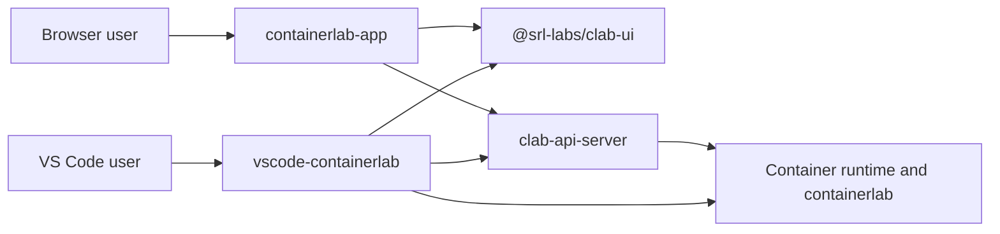
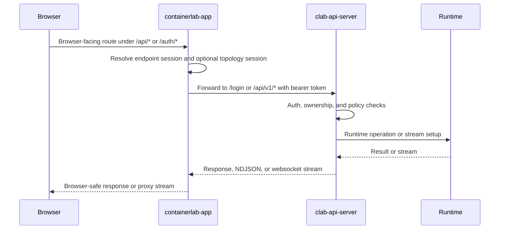
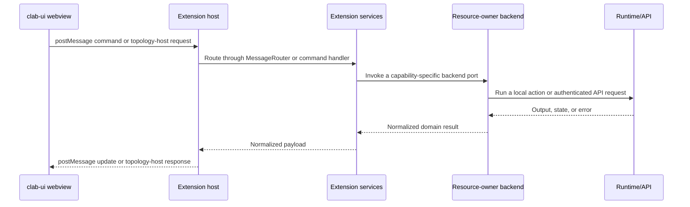
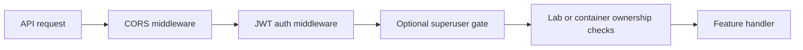
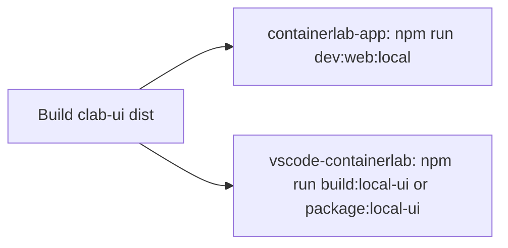

# 0. Platform Deep Dive

This is the fastest full-system explanation of how the four repos fit together, where control actually lives, and which seams are most likely to break.

## In one minute

!!! abstract "What actually happens"
    - `clab-ui` is the reusable UI package.
    - `containerlab-app` hosts that package in the browser and forwards privileged work to `clab-api-server`.
    - `vscode-containerlab` hosts the same package inside VS Code webviews and routes work through extension commands and services.
    - `clab-api-server` is the runtime authority for browser-hosted flows.

## Main components

| Component | Primary role | Typical consumer-facing surface |
|---|---|---|
| `clab-ui` | Shared package and contracts | `@srl-labs/clab-ui` exports |
| `containerlab-app` | Browser SPA host, endpoint-session manager, gateway | `/auth/*`, `/files`, `/api/*` |
| `clab-api-server` | Authenticated control plane and runtime access | `/login`, `/api/v1/*` |
| `vscode-containerlab` | Extension host and webview bridge | VS Code commands, `postMessage` bridge |

## Trust and control boundaries



Important boundary rules:

- Browser code never owns privileged runtime operations directly.
- The web host is a transport and session layer, not the final policy authority.
- The VS Code webview is also not the authority. The extension host is.
- `clab-ui` portability is a UX and reuse benefit, not a security boundary.

## Two hosting modes

| Dimension | Browser-hosted path | VS Code-hosted path |
|---|---|---|
| Host repo | `containerlab-app` | `vscode-containerlab` |
| Transport | HTTP, SSE, websocket, browser cookies | VS Code `postMessage`, command dispatch |
| Runtime owner | `clab-api-server` | selected local adapter or `clab-api-server` |
| Auth gate | endpoint session + JWT | local environment checks or extension-host JWT session |
| High-risk drift | route/session/proxy mismatch | command/message router mismatch |

## Canonical browser path



## Canonical VS Code path



## Cross-repo contracts that matter most

| Contract | Producer | Consumer |
|---|---|---|
| Export map for `@srl-labs/clab-ui/*` | `clab-ui` | web and VS Code hosts |
| `ClabUiHost` and topology session semantics | `clab-ui` | host implementations |
| Browser-facing gateway routes | `containerlab-app` | browser app code and `clab-ui` API host usage |
| `/api/v1/*` semantics | `clab-api-server` | `containerlab-app` |
| Extension commands and bridge message handling | `vscode-containerlab` | `clab-ui` webviews |

## Highest-risk coupling points

| Risk | Why it breaks | First place to inspect |
|---|---|---|
| Export drift | consumer imports a subpath that is no longer exported | `clab-ui/package.json`, consumer imports |
| Host contract drift | required host methods are missing or partially implemented | `clab-ui/src/host/contracts.ts`, host implementation |
| Route mapping drift | browser-facing route no longer matches API upstream behavior | `containerlab-app/packages/app-server/src/*.ts` |
| Endpoint or topology session drift | wrong endpoint or stale topology session selected | `containerlab-app/packages/app-server/src/middleware.ts`, `topologySessionManager.ts` |
| Extension command drift | webview sends a command with no matching handler | `vscode-containerlab/src/extension.ts`, `MessageRouter.ts` |

## Auth and ownership pipeline



Status codes you will see often:

- `401`: missing, malformed, expired, or invalid bearer token
- `403`: authenticated, but the action is explicitly forbidden
- `404`: resource not found, or intentionally concealed by ownership policy

## Streams and long-lived connections

| Stream class | Browser-facing path | Typical failure mode |
|---|---|---|
| Platform event feed | `/api/events` | endpoint session expired or upstream stream failure |
| Topology file events | `/api/topology/events` | stale topology session or lab path mismatch |
| Terminal websocket | `/api/runtime/terminal-sessions/:id/stream` | terminal session expired or upstream websocket closes |
| VNC websocket | `/api/runtime/capture/wireshark-vnc-sessions/:id/vnc/websockify` | capture-session mapping missing or upstream not ready |

## Local development contract

The local sibling-repo flow is strict on purpose.

1. Build `clab-ui` so `dist/` exists and matches current source.
2. Start a consumer in its local-ui mode.
3. Rebuild `clab-ui` whenever you change the shared package.



## Release contract

| Step | Source of truth |
|---|---|
| Package version | `clab-ui/package.json` |
| Release trigger | tag `vX.Y.Z` matching package version |
| Publish workflow | `clab-ui/.github/workflows/publish-package.yml` |
| Consumer adoption | dependency bump in `containerlab-app` and `vscode-containerlab` |

## Quick operator commands

```bash
# Build the shared package
cd /home/flschwar/projects/clab/clab-ui
npm run build

# Run the browser host against the local shared package
cd /home/flschwar/projects/clab/containerlab-app
npm run dev:web:local

# Build the VS Code extension against the local shared package
cd /home/flschwar/projects/clab/vscode-containerlab
npm run build:local-ui
```

## Deeper references

- [11. Web Route and Proxy Matrix](11-web-route-and-proxy-matrix.md)
- [12. API Endpoint Taxonomy](12-api-endpoint-taxonomy.md)
- [13. VS Code Bridge Contract](13-vscode-bridge-contract.md)
- [14. clab-ui Contract Spec](14-clab-ui-contract-spec.md)
- [15. Failure Mode Atlas](15-failure-mode-atlas.md)
