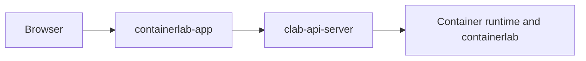
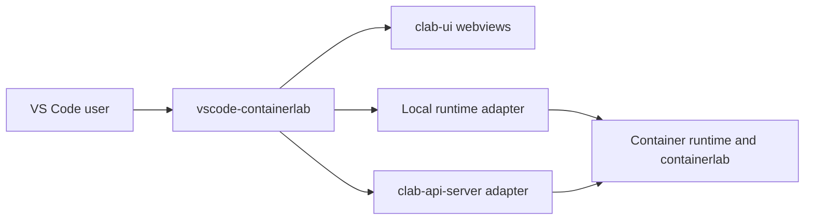

# 1. Big Picture

This page describes the intended architecture before getting into route tables and protocol details.

## Architectural intent

The platform is split so the reusable UI stays reusable:

- `clab-ui` is a publishable package, not an app-specific repo.
- `containerlab-app` is the browser host and gateway.
- `clab-api-server` is the authenticated runtime authority for web-hosted flows.
- `vscode-containerlab` is the extension host and combines local runtime integration with zero or more direct clab-api-server backends.

That separation is what allows the same topology UI to run in both a browser product and a VS Code webview without forking the package.

## Deployment shapes

### Browser-hosted platform

### VS Code-hosted platform

## Ownership split

| Concern | Primary owner | Why this split exists |
|---|---|---|
| UI rendering, topology UX, inspect and feature views | `clab-ui` | shared across both hosts |
| Authenticated API and runtime policy | `clab-api-server` | browser and remote VS Code flows need a server-side authority |
| Browser session handling and proxying | `containerlab-app` | browser code cannot safely own privileged runtime access |
| VS Code backend registry, credentials, commands, and file access | `vscode-containerlab` | extension APIs, secret storage, resource routing, and local/remote adapters live there |

## What should remain stable

!!! info "Integration stability rule"
    The most important stable boundary is the public `@srl-labs/clab-ui` surface. Consumers should use exported package subpaths only and avoid repo-internal imports.

The contracts that need careful versioning are:

- `clab-ui/package.json` exports
- `ClabUiHost` and topology session behavior
- Browser-facing route semantics in `containerlab-app`
- `/api/v1/*` semantics in `clab-api-server`
- VS Code command and message contracts used by the webviews

## Where coupling still exists

| Coupling | Impact | Practical mitigation |
|---|---|---|
| Consumers rely on specific `clab-ui` subpaths | import failures when exports change | keep the export map explicit and versioned |
| Web gateway routes must match API server behavior | runtime actions fail even if UI code is fine | keep proxy modules small and route-specific |
| API auth and ownership behavior shape browser UX | same user action may surface as `401`, `403`, or `404` | document and test edge cases |
| Local and API VS Code backends have different feature parity | UI can expose an action the selected resource's backend cannot run | publish resource-scoped `ClabUiHost.capabilities` and guard commands in the extension host |
| Local development relies on sibling-repo conventions | stale or missing `dist/` creates confusing failures | use strict local-mode scripts and rebuild often |
