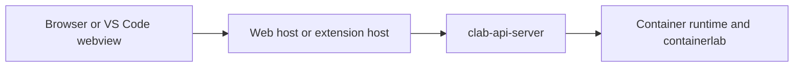

# 8. Security and Operations

This page summarizes where trust boundaries actually are, which layer enforces what, and what has to be true before the platform is safe to operate.

## Security boundaries

The highest-risk boundary is between a privileged runtime authority and the
container runtime. In local VS Code mode that authority is the extension-side
local adapter; in browser and remote VS Code modes it is clab-api-server. A
webview is never a trusted authority.

## What enforces access at each layer

| Layer | Enforcement mechanism | Notes |
|---|---|---|
| Browser host | browser session cookie + saved endpoint sessions | only chooses and forwards endpoint context; not the final policy authority |
| API authentication | JWT bearer token | enforced on `/api/v1/*` |
| API authorization | Linux groups + handler-specific policy | `API_USER_GROUP`, `SUPERUSER_GROUP`, and explicit handler checks |
| Resource ownership | lab/container ownership helpers | often returns `404` to conceal unauthorized resources |
| VS Code extension | backend registry, owner-based routing, local checks, secret-stored API JWTs, and exact per-endpoint TLS certificate pins | first-use trust and certificate changes require extension-host approval; tokens never enter webviews or ordinary settings |
| Runtime access | host privileges and runtime availability | without this, authenticated requests still fail |

## Operational constraints

| Constraint | Consequence if ignored |
|---|---|
| `clab-api-server` must run with sufficient host privileges | runtime, capture, and network operations fail or become unsafe |
| Group membership must be managed intentionally | users are over-privileged or unexpectedly blocked |
| `JWT_SECRET` must not be left at an insecure default | bearer tokens are not trustworthy |
| `CORS_ALLOWED_ORIGINS` must match real browser origins | browser-hosted flows fail despite otherwise-correct code |
| `TRUSTED_PROXIES` should be configured explicitly | generated URLs and proxy-aware behavior can drift |
| Local VS Code users need local environment access | the local backend can activate but still fail to perform runtime actions |
| Remote VS Code users need a trusted API endpoint | expired tokens, incompatible capabilities, or untrusted certificates block API mode |

## Rollout checklist

1. Set a real `JWT_SECRET`.
2. Review `API_USER_GROUP` and `SUPERUSER_GROUP` membership.
3. Configure `CORS_ALLOWED_ORIGINS` for every browser origin you intend to support.
4. Configure `TRUSTED_PROXIES` if the API server sits behind a proxy.
5. Verify the API server process can reach the container runtime.
6. Verify browser-host, local VS Code, and API-backed VS Code flows separately, because they fail differently.

## Things the shared UI does not guarantee

!!! warning "Shared UI is not shared authorization"
    `clab-ui` makes the UX reusable. It does not make runtime access safe by itself.

Do not assume any of the following just because the UI renders correctly:

- the API bearer token is valid
- the user belongs to the required Linux groups
- the user owns the lab or container they are touching
- the runtime and capture tools are reachable
- the extension host has the local privileges it needs

## Tracked dependency exception

As of 2026-07-09, the production dependency audit reports the sanitizer
advisories inherited through `monaco-editor` 0.55.1. That Monaco release pins
DOMPurify 3.2.7 and also vendors the same implementation into its browser
sources and generated editor bundle. There is no newer stable Monaco release
that removes the affected implementation.

This is an accepted upstream risk, not a resolved finding. Do not add an npm
`overrides` entry merely to make the audit report green: replacing the nested
package would leave Monaco's vendored implementation unchanged. The
`clab-ui` release owner must recheck this exception whenever Monaco publishes a
new stable release, and must verify both the dependency tree and the bundled
editor code before closing it. A local alias or patch is acceptable only with
focused sanitizer and Monaco rendering tests.
