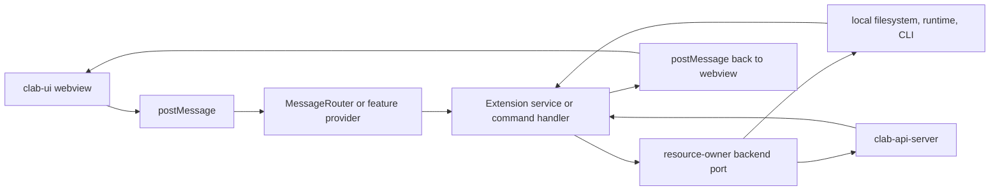
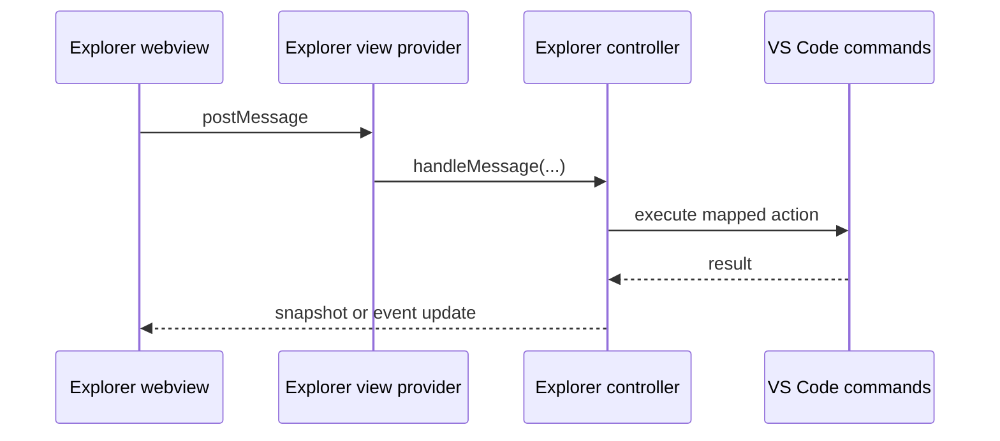

# 13. VS Code Bridge Contract

This page describes how `vscode-containerlab` hosts `clab-ui` webviews and turns UI messages into extension-host behavior. The extension host may combine its local containerlab integration with multiple authenticated `clab-api-server` connections; those transports remain invisible to the webview.

## One-sentence model

The webview renders shared UI, but `TopologyHostCore`, `MessageRouter`, and extension commands own the authoritative state and runtime side effects.

## Bridge layers

## Topology viewer flow

| Step | Component | Behavior |
|---|---|---|
| 1 | command registration | `containerlab.lab.graph.topoViewer` opens the topology viewer |
| 2 | provider | `ReactTopoViewerProvider.openViewer(...)` reuses a viewer by `labPath` or creates one |
| 3 | panel bootstrap | `ReactTopoViewer` creates the webview panel and injects bootstrap data |
| 4 | authoritative topology state | `TopologyHostCore` owns topology document state for the panel |
| 5 | message routing | `MessageRouter` handles topology-host protocol messages plus semantic UI commands |
| 6 | services | lifecycle, node, capture, custom-node, icon, export, and split-view services execute work |
| 7 | watchers | file and Docker-image watchers push updates back to the webview |

## Message classes

| Message class | Direction | Examples |
|---|---|---|
| topology-host protocol | webview -> extension and extension -> webview | `topology-host:get-snapshot`, `topology-host:command`, `topology-host:ack`, `topology-host:reject` |
| semantic UI commands | webview -> extension | lifecycle commands, `clab-node-connect-ssh`, `clab-interface-capture`, icon and export commands |
| push events | extension -> webview | `topo-mode-changed`, `custom-nodes-updated`, `icon-list-response`, `lab-lifecycle-status`, `lab-lifecycle-log`, `svg-export-result` |

JWTs, passwords, CA paths, and backend URLs remain in the extension host. They must not be placed in webview bootstrap data or forwarded as bridge messages.

## Backend routing and capabilities

Backends initialize independently and coexist in a workspace registry:

| Backend | Activation prerequisites | Resource identity |
|---|---|---|
| local | Linux, local containerlab binary, runtime access and configured groups | local URI plus backend id |
| API | reachable compatible API, trusted TLS policy and authenticated session | endpoint/backend id plus lab name and remote resource id |

Commands and bridge handlers call backend operation ports instead of branching on transport. A `LabRef`-style identity is carried through tree items, viewer sessions and runtime matching so mutations route to the owner. A first deployment with several available backends asks the user for a destination. A server path must never be interpreted as a local path.

`ClabUiHost.capabilities` is the UI-level contract. It tells the shared package which lifecycle, node and optional feature affordances the current topology resource's backend supports. The API's authenticated capability document is the server compatibility contract. The extension maps the latter to the former and defaults unavailable operations closed.

API credentials belong in VS Code `SecretStorage`. TLS verification policy is machine-scoped; a deliberate unverified connection still requires confirmation and must never mutate process-global TLS behavior.

## Remote topology bundles

A topology is more than its YAML file: relative startup configs, certificates, binds, icons and scripts are part of the deployment input. Initial remote deployment therefore transfers a bounded topology bundle under an explicit source root. Apply/redeploy must synchronize the same bundle; until the API offers an atomic bundle-update contract, the extension blocks those actions for bundle-backed labs instead of silently updating only YAML. Files outside the root, symlinks, and generated or secret-heavy directories require a deliberate policy rather than being copied implicitly.

## Explorer flow

The explorer path is separate from the topology-host protocol. It uses explorer-specific snapshot and action messages instead.

## Feature-specific paths

| Feature | High-signal behavior |
|---|---|
| Inspect | commands `containerlab.inspectAll` and `containerlab.inspectOneLab` open inspect webviews and respond to refresh events |
| Capture / Wireshark VNC | capture commands create containers or sessions locally and the webview performs readiness polling through posted messages |
| Node impairments | `containerlab.node.manageImpairments` opens a panel and the extension sends refreshed impairment state back to the webview |
| Split view | `topo-toggle-split-view` is handled inside `MessageRouter` and `SplitViewManager` |
| SVG/Grafana export | webview posts export payload, extension writes files and responds with `svg-export-result` |

## Local shared-package mode

| Condition | Behavior |
|---|---|
| `CLAB_UI_SOURCE=local` and `../clab-ui/dist/index.js` exists | `esbuild.config.js` aliases `@srl-labs/clab-ui/*` to the local `dist/` tree |
| `CLAB_UI_SOURCE=local` but local `dist/` is missing | local build fails fast |
| env var absent | published package resolution is used |

## High-signal source anchors

- `vscode-containerlab/src/extension.ts`
- `vscode-containerlab/src/commands/graph.ts`
- `vscode-containerlab/src/reactTopoViewer/extension/ReactTopoViewerProvider.ts`
- `vscode-containerlab/src/reactTopoViewer/extension/panel/MessageRouter.ts`
- `vscode-containerlab/src/commands/inspect.ts`
- `vscode-containerlab/src/commands/capture.ts`
- `vscode-containerlab/src/commands/nodeImpairments.ts`
- `vscode-containerlab/esbuild.config.js`
