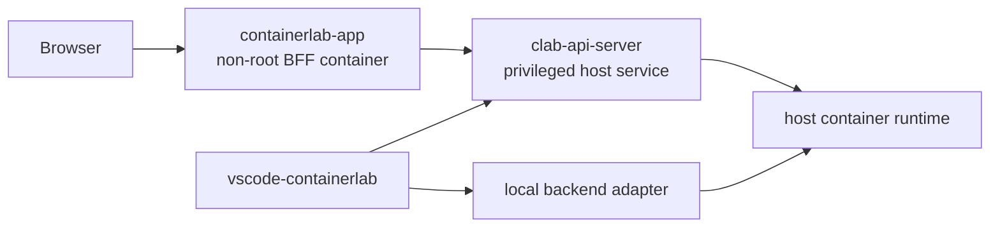

# 16. Backend and Deployment Boundaries

This decision record defines where code belongs now that VS Code can combine a
local backend with multiple clab-api-server backends and the web application is distributed as a
container.

## Approved deployment shapes



The app container never receives the host runtime socket, network namespaces,
PID namespace, or containerlab binary. A bind-mounted host binary still runs
inside the container; making it control the host would require the same
host-equivalent privileges that the API boundary exists to contain.

## Ownership rules

| Concern | Owner |
|---|---|
| React views, topology core/session protocol, generic capability vocabulary | `clab-ui` |
| Local/API registry and routing, VS Code commands, SecretStorage, endpoint TLS policy | `vscode-containerlab` |
| Browser cookies, endpoint selector, same-origin BFF and stream proxying | `containerlab-app` |
| PAM identity, authorization, workspace isolation, runtime/network operations | `clab-api-server` |
| `/api/v1` schemas and future generated client | `clab-api-server` |

`clab-ui` must not learn backend names, URLs, JWTs, Fastify routes, VS Code
settings, Docker sockets, or Linux paths. It receives normalized domain data
and `ClabUiHost.capabilities` only.

## VS Code backend seam

Extension commands depend on capability-specific operations rather than a
transport:

```text
command / message router
        |
        v
lab, node, image, capture, event operation ports
        |
        +-- local adapter: CLI + filesystem + runtime client
        |
        +-- API adapter: authenticated HTTP + NDJSON/WebSocket transport
```

Backend instances initialize independently. Linux, local containerlab, group,
and runtime-socket checks apply only to the local adapter and do not block API
profiles. Each resource carries its owner backend id through the command path.
API credentials stay in the extension host; JWTs use SecretStorage and never
enter webview bootstrap data or logs.

Within the VS Code API adapter, connection/session/runtime state belongs to the
backend instance, while a typed operations client owns `/api/v1` paths and
request/response DTOs. Explorer providers and commands call that operations
client through the resource-owning backend. This keeps protocol mapping out of
tree providers and prevents the browser BFF client from being copied into the
extension.

## Resource identity

A host absolute path is not a cross-machine identity. Host integrations should
carry an explicit backend/endpoint id, lab name, and either a local URI or a
remote workspace-relative resource id. Do not make a server path look like a
client filesystem path.

For an initial local-source remote deployment, transfer the complete topology
bundle so relative startup configs, binds, annotations, and icons remain
intact. Remote editing may use a host-managed local working copy, but its
backend ownership must remain explicit and writes must return through the API;
the cached host path is never the cross-machine resource identity. A future
filesystem provider can replace that cache without changing the UI contract.

## Contract and release rules

1. The API OpenAPI document is the wire-contract source of truth.
2. A generated, runtime-neutral TypeScript client should be published from the
   API contract and consumed by both hosts; it must not move into `clab-ui`.
3. `ClabUiHost.capabilities` gates product affordances while API capability
   discovery handles server-version compatibility.
4. Release the API contract/client first, then `clab-ui`, then consumers.
5. CI should pack the real packages and compile both consumers against them,
   plus exercise JSON, fragmented NDJSON, cancellation, and WebSocket fixtures.

The generated client and capability contract must also classify the API v1
surface explicitly: which routes are mandatory core v1 operations, which
endpoint families require features such as `topology-files` or
`workspace-files`, and which features select an encoding such as lifecycle or
event NDJSON. The current releases are validated as a matched set;
`containerlab-app` assumes that matched server surface, while VS Code mainly
gates local-source lifecycle on lifecycle discovery. That is not a promise of
full behavior across arbitrary client/server version combinations. Until the
classification is generated and enforced, add a consumer gate before making
any advertised feature optional.

## Security invariants

- The API listener, advertised host, and TLS names are separate configuration
  concepts.
- TLS verification is per endpoint and enabled by default; no process-global
  certificate bypass is allowed.
- Browser-provided endpoint URLs are policy checked before server-side access
  to prevent SSRF.
- User-controlled file operations remain beneath a symlink-safe workspace
  boundary.
- Process-global current-directory or identity environment mutation cannot run
  concurrently across API requests.
